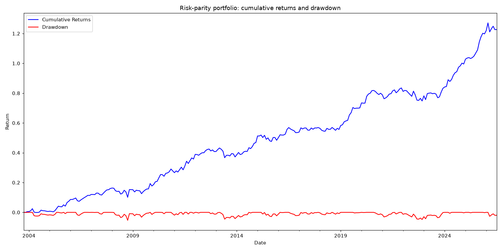
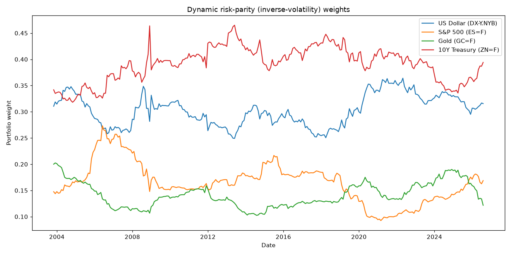
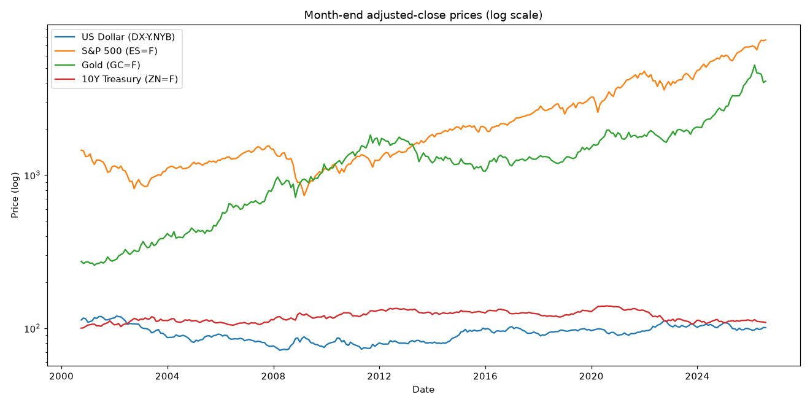

A research notebook that builds and **backtests a risk-parity portfolio** end to end on
monthly data across four macro asset classes: US equities, Treasuries, gold, and the US
dollar. Risk-parity allocates capital so that **each asset contributes equally to total
portfolio risk**, holding more of the calm assets and less of the volatile ones, rather
than weighting by capital or conviction. The notebook downloads front-month futures /
index data with `yfinance`, computes dynamic inverse-volatility weights on a rolling
window, and then evaluates the resulting strategy on a full suite of risk-adjusted
metrics. The data is pulled live from Yahoo Finance (2000–present).

> Conclusion:
> I learned how to turn a portfolio-construction idea, equalizing risk contribution, into
> a concrete inverse-volatility weighting scheme, and how to make it *dynamic* by
> recomputing weights on a rolling volatility window. I saw why the weights must be
> **shifted by one period** to avoid look-ahead bias, so each month's allocation only uses
> information available beforehand. Finally I learned to judge a strategy not by return
> alone but by its full risk profile, volatility, skewness, kurtosis, max drawdown, and
> the Sharpe / Sortino / Calmar risk-adjusted ratios.

## What it does

**Data & preparation**
1. **Download**: pull front-month futures / index history via `yfinance` for four assets, S&P 500 (`ES=F`), 10-year Treasuries (`ZN=F`), gold (`GC=F`), and the US Dollar Index (`DX-Y.NYB`), from 2000 onward (`yf.download`).
1. **Resample**: collapse noisy daily data to month-end observations (`resample('ME').last()`).
1. **Clean**: subset adjusted-close prices, forward-fill gaps, and drop remaining NaNs (`ffill`, `dropna`).
1. **Returns**: compute monthly arithmetic returns (`pct_change`).

**Risk-parity weights**
1. **Rolling volatility**: 36-month rolling standard deviation of each asset's returns (`rolling(window=36).std()`).
1. **Inverse volatility**: weight each asset by `1 / volatility`, so less volatile assets get more capital.
1. **Normalize**: scale weights to sum to 1 each period (`div(..., axis=0)`).
1. **Shift**: lag weights by one period (`.shift(1)`) so allocations use only past information, avoiding look-ahead bias (`compute_risk_parity_weights`).

**Portfolio returns**
1. **Weighted returns**: multiply each asset's return by its weight and sum across assets (`(returns * weights).sum(axis=1)`).

**Performance evaluation**
1. **Return & risk**: annualized mean return and annualized volatility (`× 12`, `× √12`).
1. **Distribution shape**: skewness and (Pearson) kurtosis of monthly returns.
1. **Drawdown**: cumulative returns, running maximum, and maximum peak-to-trough drawdown.
1. **Risk-adjusted ratios**: Sharpe (return / volatility), Sortino (return / downside volatility), and Calmar (return / max drawdown).

**Plot**
1. **Equity curve**: cumulative returns and drawdown over time on a shared axis.

## Selected results

The backtest runs on **274 monthly observations (Oct 2003 – Jul 2026)**, the first 36
months are consumed by the rolling window and the one-period shift:

| Metric | Value |
| --- | --- |
| Annualized mean return | **3.58%** |
| Annualized volatility | **3.67%** |
| Skewness | 0.11 |
| Kurtosis | 4.27 |
| Maximum drawdown | **−5.34%** |
| **Sharpe ratio** | **0.98** |
| **Sortino ratio** | **1.58** |
| **Calmar ratio** | **0.67** |

**Diversifying across uncorrelated macro assets keeps risk remarkably low.** Annualized
volatility is only ~3.7% and the worst peak-to-trough loss over 22 years is a shallow
**−5.3%**, a Sharpe ratio near **1.0** on such a low-volatility book shows the
risk-parity balancing is doing real work rather than just holding cash. The Sortino ratio
(**1.58**) comfortably exceeds the Sharpe, and skewness is mildly positive, so the
strategy's variability is not dominated by downside moves. The elevated kurtosis (**4.27**)
is the one caution flag: returns have fatter tails than a normal distribution, so rare
large months do occur.

The equity curve grows steadily with only minor, quickly-recovered drawdowns:



The dynamic weights adapt as each asset's volatility shifts, tilting toward whichever
assets are calmest at the time:



The underlying month-end prices (log scale) show the four assets the strategy blends:



## Run it

This project uses [pixi](https://pixi.sh) for a reproducible environment (Python 3.12):

```bash
pixi install
pixi run lab   # launches: jupyter lab --no-browser --port=7772
```

> **Used:** python · pandas · numpy · yfinance · matplotlib

See [`evaluating-and-backtesting-a-dynamic-investment-strategy.ipynb`](evaluating-and-backtesting-a-dynamic-investment-strategy.ipynb) for the complete analysis.
